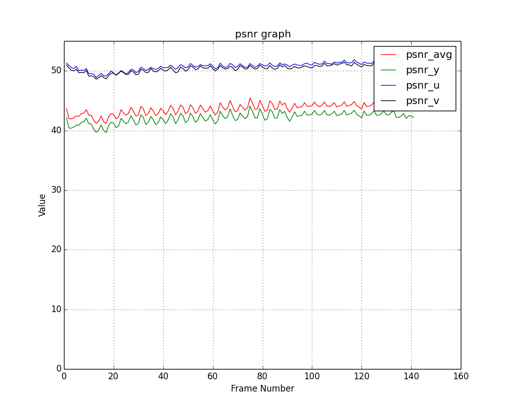
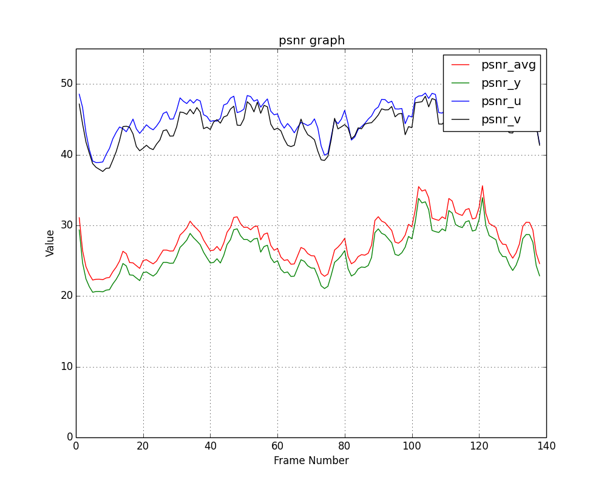
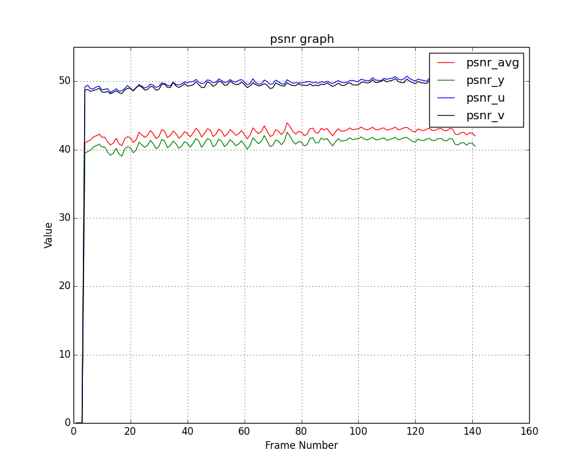

# video_codec_evaluation
用于对音视频编解码器进行分析，例如丢帧，卡顿等。

## 编译依赖
该项目依赖如下的项目：

* ffmpeg
* opencv
* boost
* yaml-cpp
* pkg-config
* rapidjson
* http_request

其中rapidjson和http_request是头文件，已经包含在该项目中，无需处理，但是其它的依赖需要自行解决。
编译过程依赖pkg-config对依赖进行管理，因此需要首先安装pkg-config。
安装好各种编译依赖之后，直接运行`make`即生成项目的各种工具。

在编译过程中，可能会出现**无法找到xxx.pc**的提示，此时，按照提示，将对应依赖的pkg-config配置文件路径增加到`PKG_CONFIG_PATH`环境变量即可。

项目默认关闭debug选项，也就是很多中间结果信息没有打印出来，如果希望开启debug选项，在make时增加`DEBUG=1`。具体方法为：

```shell
make DEBUG=1 #注意：DEBUG需为大写
```

## videoLabelProcess.sh
在视频的指定区域给视频增加帧号信息。

## vpsnr
与传统的psnr相比，vpsn有如下的优势：

* vpsnr用于计算两个视频之间的psnr，并且对每帧视频的psnr进行时间、空间维度的可视化展示，从而避免psnr的单一的平均结果无法描述视频中的不同区域的折损的情况。
* vpsnr还会考虑手机等移动设备在拍摄视频过程中存在的视频旋转的情况，vpsnr内部会自动对视频进行旋转处理。
* vpsnr还增加了计算视频丢帧信息的功能，避免丢帧对psnr的结果带来的不准确性。如果需要开启丢帧检测，请使用`videoLabelProcess.sh`对视频t1.mp4增加标记生成t2.mp4，然后再对处理之后的视频进行各种转码操作并得到t3.mp4，然后利用vpsnr计算t2.mp4和t3.mpr的psnr。
* 为了避免自动丢帧检测存在的误差，可以利用`-f`参数手动指定丢帧信息，从而提高psnr的准确性。

vpsnr的使用如下所示：
```shell
$ vpsnr
usage: vpsnr --refVideo=string --mainVideo=string [options] ...
options:
  -r, --refVideo           含有噪声视频的参考视频 (string)
  -m, --mainVideo          含有噪声的视频 (string)
  -b, --blockSize          计算分块psnr的块大小 (int [=1])
  -d, --dropFrameDetect    是否执行丢帧检测 (bool [=0])
  -f, --dropFrameInfoFile    手动指定丢帧信息文件 (string [=])
  -?, --help               print this message

$ vpsnr -r videoDB/t12.mp4 -m videoDB/t13.mp4 -b 4
```

vpsn对每帧视频的psnr的可视化结果如下所示：


如图所示：psnr越大的区域，灰度值越高；psnr越小的区域，灰度值则越低。通过vpsnr的可视化之后，就能评估出视频的不同区域的psnr的范围。

#### recog/video_figure_recog/psnr_graph.py
时间维度的psnr可视化工具，使用该工具可以将vpsnr工具计算的每帧图像的psnr结果以时间维度进行可视化。具体效果如下：



#### 丢帧视频的psnr对比
利用psnr_graph.py工具分析丢帧对视频的psnr结果带来的干扰，具体如下图所示。

**传统psnr算法的计算结果如下：**



**vpsnr算法的计算结果如下：**



## checkdropframe
该命令用于检测旋转视频被处理之后的丢帧信息。

如果用手机拍摄的原始视频为t1.mp4，则对于t1的存储数据是存在某个旋转角度的，一般后置摄像头会旋转270度，而前置摄像头会旋转90度。如果需要得到正确的预览视频，则需要对t1.mp4进行一定的旋转，后置摄像头需要旋转90度，而前置摄像头需要旋转270度。

利用`videoLabelProcess.sh`对t1.mp4进行无旋转的预处理，在视频的指定区域增加每一帧的帧号信息，得到视频t2.mp4。

视频处理工具（例如`ffmpeg`，`拍摄器`等）对t2.mp4进行处理得到t3.mp4，会自动进行旋转处理，以得到正确的视频。但是在旋转的过程中也对原始的标签区域进行了旋转，因此需要做对应的处理才能提取到原视频中的帧号信息。利用`checkdropframe`对t3.mp4进行处理，得到帧号数据，并存储在指定目录下。

`checkdropframe`会生成一个向量来存储视频t3.mp4的丢帧信息，向量的大小为t2.mp4的帧数，向量的每个位置对应t2.mp4对应帧是否在t3.mp4中存在。例如`[0, 0, 1, 1, 3]`表示在t3.mp4中丢失了第0帧和第1帧，而第4帧则存在3帧。

```shell
$ checkdropframe

checkdropframe
usage: checkdropframe --mainVideo=string --refVideo=string [options] ...
options:
  -m, --mainVideo    待检测丢帧的视频 (string)
  -r, --refVideo     原视频 (string)
  -?, --help         print this message
``` 
